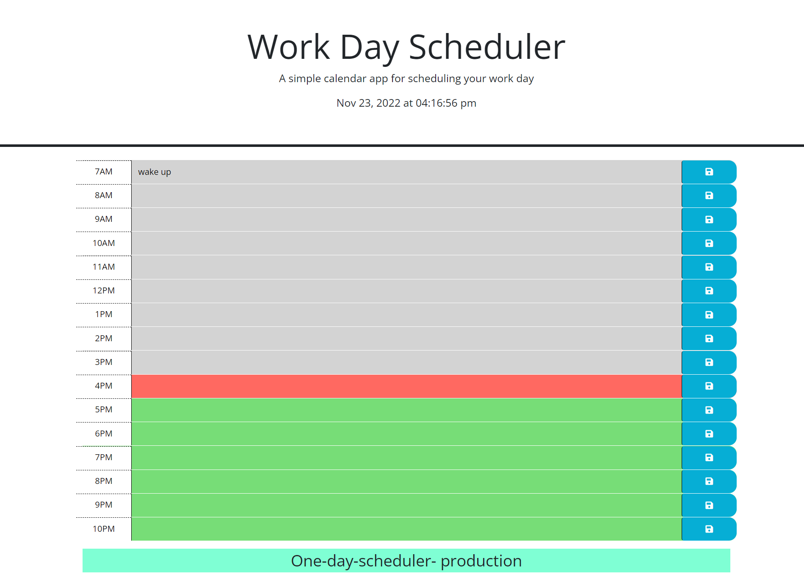

# Feliks-day-scheduler
## Description 
 The given Work-Day scheduler is intended to schedule user's event at the certain time point. The app allows user to save scheduled event to local storage for further usage. Moreover scheduler keeps track of time and can indicate  and highlight past, present  and future event( past- gray background color, present - red background color, future - greed background color)
   github repo:https://github.com/felixbor/Feliks-day-scheduler
   github page: https://felixbor.github.io/Feliks-day-scheduler/
   